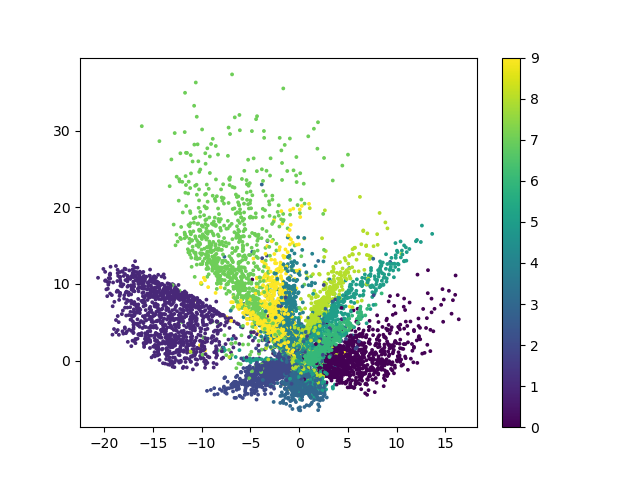

 # DAE with Noise added at Different Layers
This repository is for comparing the performance of Denoising Autoencoder (DAE) when noise is added to different layers.

# Usage

```shell
conda install pytorch==1.12.0 torchvision==0.13.0 torchaudio==0.12.0 cudatoolkit=10.2 -c pytorch
conda install matplotlib
```

```shell
    python train.py
    python plot_result.py
```
# Symstem model
Each index(noise_idx) represents the location where noise is added.
- train SNR : 12dB
- test SNR : 12dB
- Dataset : Mnist (train : 54000, test : 6000)


# 2-dim Manifold result

*noise_idx* | *result* | *noise_idx* | *result*
:---: | :---: |:-----------:| :---: | 
0 | |      2      |  
4 | |      6      |  
8 | |     10      |  

# re-generation result
*noise_idx* |                                        *result*                                        
:---: |:--------------------------------------------------------------------------------------:
0 |   | 
1 |   | 
2 |   | 
3 |   | 
4 |   | 
5 |  | 

# re-generation with noisy-input result 
*DNN* |                                    *CNN*                                     | *DAE* 
:---: |:----------------------------------------------------------------------------:| :---: 
 |  | 

